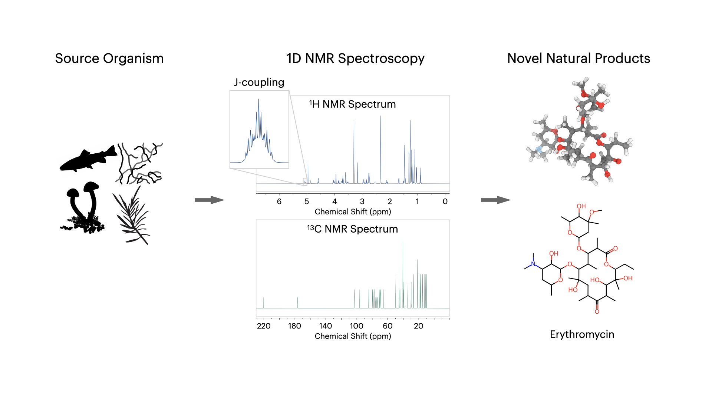

# ChefNMR🧑‍🍳⚛️: Atomic Diffusion Models for Small Molecule Structure Elucidation from NMR Spectra

## [Paper](https://openreview.net/pdf?id=STsjfx2cee) | [Dataset & Checkpoints](https://zenodo.org/records/17766755) 

This repository provides the official implementation of the paper ChefNMR (**CH**emical **E**lucidation **F**rom **NMR**): "Atomic Diffusion Models for Small Molecule Structure Elucidation from NMR Spectra".



## News

- **[2025-12-02]** Initial code release!

## Environment Setup

We recommend using [Conda](https://docs.conda.io/en/latest/) to manage the environment.

```bash
git clone https://github.com/ml-struct-bio/chefnmr.git
cd chefnmr
conda env create -f ./environment.yaml -n nmr3d
conda activate nmr3d
```

## Download Data & Checkpoints

Please download the datasets and pretrained model checkpoints from [Zenodo](https://zenodo.org/records/17766755).

### Directory Structure

After downloading and unzipping, organize your folders as:

```text
chefnmr/
├── datasets/                  # Processed NMR datasets (See Table 1 in the paper)
│   ├── spectrabase/
│   │   ├── data.txt           # Example data structure of the molecules.h5 file
│   │   ├── molecules.h5       # HDF5 file containing molecule structures and spectra
│   │   └── stat.txt           # Some dataset statistics
│   ├── uspto/
│   ├── spectranp/
│   ├── real-specteach/
│   └── real-nmrshiftdb2/
├── meta/
│   ├── MOL_IDX.db             # One-to-one mapping between molecule index and canonical SMILES
│   └──  grids/                 # Precomputed ppm grids for spectra (See Appendix Table 4 in the paper)
│       ├── C10k.p             # 10k-dim C NMR ppm grid uniformly spaced [-20, 230] ppm
│       ├── H10k.p             # 10k-dim H NMR ppm grid uniformly spaced [-2, 10] ppm
│       └── C80.p              # 80-dim C NMR ppm grid uniformly spaced [3.42, 231.3] ppm
├── checkpoints/               # Pretrained model weights
│   ├── SB-H10kC80-S128-epoch10099.ckpt  # ChefNMR-S, SpectraBase H10k + C80
│   ├── SB-H10kC80-L128-epoch5249.ckpt   # ChefNMR-L, SpectraBase H10k + C80
│   ├── US-H10kC10k-S128-epoch10849.ckpt # ChefNMR-S, USPTO H10k + C10k
│   ├── US-H10kC10k-L128-epoch3099.ckpt  # ChefNMR-L, USPTO H10k + C10k
│   ├── US-H10kC80-S128-epoch6299.ckpt   # ChefNMR-S, USPTO H10k + C80
│   ├── US-H10kC80-L128-epoch3099.ckpt   # ChefNMR-L, USPTO H10k + C80
│   ├── NP-H10kC10k-S128-epoch26599.ckpt # ChefNMR-S, SpectraNP H10k + C10k
│   └── NP-H10kC10k-L64-epoch18149.ckpt  # ChefNMR-L, SpectraNP H10k + C10k
├── script/
│   ├── 00-training/            # Training scripts for different datasets
│   └── 01-sampling/            # Sampling scripts to reproduce paper results
├── src/                        # Source code
├── configs/                    # Configuration files
└── ...
    
```

After organizing the project folder, update the dataset paths. In `./configs/data/**.yaml`, set

   ```yaml
   dataset_args:
     datadir: "/absolute/path/to/chefnmr/datasets/<dataset_name>"
   ```

## Usage

### Quick Start: Sample with a Pretrained Checkpoint

To quickly verify your setup, sample molecules from SpectraBase using a pretrained model (make sure you have access to 1 GPU):

```bash
export CHEFNMR_DIR='/absolute/path/to/chefnmr' # Set to your project path
export CKPT_PATH="$CHEFNMR_DIR/checkpoints/SB-H10kC80-S128-epoch10099.ckpt"

conda activate nmr3d
cd "$CHEFNMR_DIR"

python -m src.main \
    +data=spectrabase \
    +condition=h1c13nmr-10k-80 \
    +model=dit-s  \
    +embedder=hybrid-baseline \
    +lddt=threshold5124 \
    +training_transform=center_rot_trans \
    +diffusion=edm-train_af3-sample_edm_sde \
    +aug_conf=conf3 \
    +guidance=cfg2 \
    +exp=eval_ckpt \
    general.experiment_name="quick_start_test" \
    dataset_args.batch_size=128 \
    general.ckpt_abs_path="$CKPT_PATH" \
    dataset_args.test_args.test_samples=100 \
    dataset_args.test_args.test_batch_size=100 \
    test_args.diffusion_samples=10 \
    test_args.num_sampling_steps=50 \
    general.seed=42
```

This command:

- Loads a pretrained model from `CKPT_PATH`.
- Samples 10 candidate molecules per target for 100 test molecules.
- Writes experimental configuration and sampling results to `./outputs/2025-12-01/12-01-15-50-40-quick_start_test/` (or similar timestamped folder).

<details> <summary><strong>Example output metrics after sampling</strong></summary>

```text
Test Epoch 10099 - 65.2s
────────────────────────────────────────────────────────
key metrics (DataLoader 0)
────────────────────────────────────────────────────────
test/matching_accuracy         79.0       # % targets with at least one exact match in top-10
test/match_acc_top1            60.0       # % exact matches at top-1
...
test/match_acc_top10           79.0       # % exact matches within top-10

test/max_similarity            0.88       # best Tanimoto similarity over top-10
test/max_sim_top1              0.75
...
test/max_sim_top10             0.88

test/amr                       3.60       # average minimum RMSD (Å)
test/amr_wo_h                  2.60       # average minimum RMSD without hydrogens (Å)

test/validity                  94.1       # % chemically valid generated molecules
test/largest_fragment_validity 94.9       # % valid largest fragments
────────────────────────────────────────────────────────
```

</details>

### Reproducing Sampling Results 

We provide SLURM scripts in `./script/01-sampling/` to reproduce the sampling experiments reported in the paper (e.g., Main Table 2, Main Figure 4, Appendix Tables 10 and 13). Each script specifies:
- dataset (e.g., SpectraBase, USPTO, SpectraNP, SpecTeach, NMRShiftDB2),
- NMR spectra type / resolution (e.g., H10k, C10k, C80),
- ChefNMR variant (S / L),
- batch size,
- classifier-free guidance (CFG) scale,
- random seed and checkpoint path.

<details>
<summary><strong>Example SLURM script name breakdown</strong></summary>

- `./script/01-sampling/00-spectrabase/SB-H10kC80-S128-cfg2-seed42.slurm`  
  SpectraBase (synthetic), 10k-dim ¹H + 80-dim ¹³C, ChefNMR-S, CFG=2.0, seed=42.

- `./script/01-sampling/00-spectrabase/SB-C80-L128-cfg2-seed42.slurm`  
  SpectraBase (synthetic), 80-dim ¹³C only, ChefNMR-L, CFG=2.0, seed=42.

- `./script/01-sampling/11-real-specteach/US-RST-H10kC80-L128-cfg1-seed42.slurm`  
  Real-SpecTeach (experimental), USPTO-trained ChefNMR-L, 10k-dim ¹H + 80-dim ¹³C, CFG=1.0, seed=42.
</details>

<details>
<summary><strong>How to run the sampling scripts with SLURM</strong></summary>

If you use SLURM, adapt the example script to your cluster environment, including:
- `#SBATCH` directives (e.g., partition, time, GPUs, memory),
- module loading (e.g., Anaconda, CUDA),
- changing the project path:
  ```bash
  export CHEFNMR_DIR='/absolute/path/to/chefnmr'
  ```

Then submit the job:

```bash
cd /path/to/chefnmr
sbatch ./script/01-sampling/00-spectrabase/SB-H10kC80-S128-cfg2-seed42.slurm
```
</details>

<details>
<summary><strong>How to run the sampling scripts not with SLURM</strong></summary>
If you **do not** use SLURM, you can run the underlying Python command directly:

1. Open any script in `./script/01-sampling/` and copy the `python -m src.main ...` line.
2. Set your paths and run:

```bash
export CHEFNMR_DIR='/absolute/path/to/chefnmr'  # Change to your project path
export CKPT_PATH="$CHEFNMR_DIR/checkpoints/SB-H10kC80-S128-epoch10099.ckpt"

conda activate nmr3d
cd "$CHEFNMR_DIR"
python -m src.main ...  # Paste the command from the script here
```
</details>

*We use 1x NVIDIA A100 or H100 for sampling. If you hit OOM, reduce `dataset_args.test_args.test_batch_size` accordingly.*

### Training from Scratch

Training scripts are in `./script/00-training/`. We use 4× A100/H100 GPUs for SpectraBase, and 8× GPUs for USPTO and SpectraNP. To start training from scratch, adapt one of the existing SLURM scripts to your cluster / environment.

To **resume training** from a checkpoint, add:

```bash
general.ckpt_abs_path="/path/to/your/checkpoint"
```

Example script:  
`./script/00-training/00-spectrabase/SB-H10kC80-S128-cfg2-gpu4-seed42-resume.slurm`

## Logging with Wandb

By default, training are logged to [Weights & Biases (Wandb)](https://wandb.ai/).

Configure logging in `./configs/config.yaml`:

```yaml
general:
  wandb: 'offline-sync' # Options: online, offline, disabled, offline-sync
```

- **online**: Syncs to WandB servers in real time (requires internet).
- **offline**: Logs stored locally; later sync with `wandb sync`.
- **disabled**: No WandB logging.
- **offline-sync**: Designed for clusters without internet on compute nodes; logs locally and sync from login nodes periodically.

For full offline-sync details, see [`src/log/README.md`](src/log/README.md).

## Citation

If you find this code useful, please cite:

```bibtex
@inproceedings{xiongatomic,
  title={Atomic Diffusion Models for Small Molecule Structure Elucidation from NMR Spectra},
  author={Xiong, Ziyu and Zhang, Yichi and Alauddin, Foyez and Cheng, Chu Xin and An, Joon Soo and Seyedsayamdost, Mohammad R and Zhong, Ellen D},
  booktitle={The Thirty-ninth Annual Conference on Neural Information Processing Systems},
  url={https://openreview.net/pdf?id=STsjfx2cee},
  year={2025}
}
```

